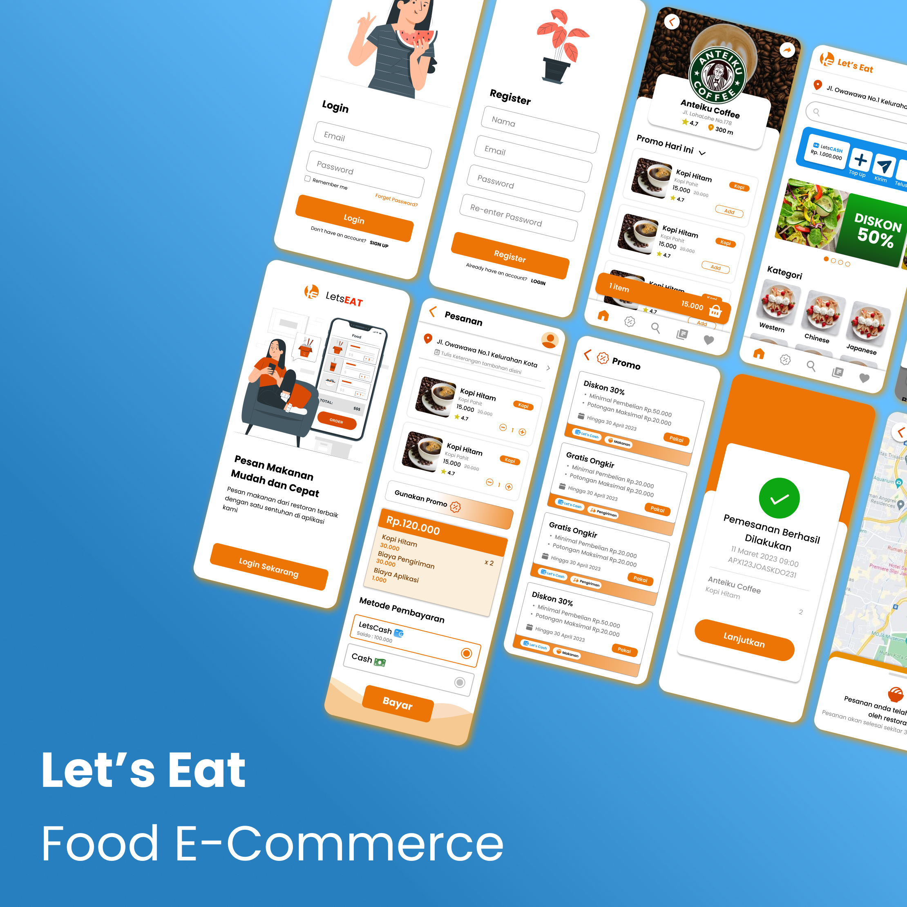

# Letseat

## Description

A Web Development project to create a food-related e-commerce website, allowing users to browse and order food from various restaurants.

## Purpose

This project aims to provide a platform for users to find and order food from various restaurants. The website will display a list of restaurants and their menus, allowing users to select items and place orders. The website will also provide information about the restaurants, such as their location, contact information, and opening hours.

## Background

The project titled "Workshop on the Implementing Software Design" was assigned to second-year computer science students at Gadjah Mada University, encompassing a comprehensive syllabus covering various aspects of software development. The project aimed to provide students with hands-on experience in developing a large-scale software project, from planning and design to implementation and testing.

Our team conceptualized and executed, LETSEAT, a food-related e-commerce website, recognizing its potential usefulness in Indonesian society given the plethora of restaurants. The website allows users to browse and order food from various restaurants, providing a convenient platform for users to explore new dining options and place orders online.

## Implementation

Despite facing initial challenges with limited web development experience, we dedicated the first month to meticulous planning, outlining the tasks necessary to create the Minimum Viable Product (MVP). Seeking guidance from the professor and collaborating with other team members, we decided to leverage the popular NEXTjs framework and utilize MongoDB as the Database.

After four months, our team successfully completed the project, overcoming challenges and bugs to implement fundamental features. The website allows users to browse restaurants, view their menus, and place orders. The website also includes an authentication system, allowing users to create accounts and log in to place orders.

## Failure

Despite our best efforts, we encountered several challenges and limitations throughout the project. We faced difficulties with the implementation of certain features, such as the maps feature, which required additional time and effort to resolve. We also encountered issues with the design and layout of the website, which required multiple iterations to achieve the desired result. Additionally, we faced challenges with time management and coordination, which led to delays in the project timeline.

## What We Learned

Throughout the project, we learned valuable lessons about teamwork, project management, and software development. We learned the importance of effective communication, collaboration, and time management in a team setting. We also learned about the software development process, including planning, design, implementation, testing, and deployment. We gained hands-on experience with web development tools and technologies, including NEXTjs, Tailwind CSS, MongoDB, and Git. Finally, we learned about the challenges and rewards of working on a large-scale software project and the importance of perseverance and dedication in overcoming obstacles.

## Conclusion

It was a rewarding experience to see our project come to life, and we are proud of the hard work and dedication we put into it. We hope that LETSEAT will continue to grow and evolve, providing a valuable service to users in the future.

## Contributors

| Name                  | Role                          | Responsibilities                       |
|-----------------------|-------------------------------|----------------------------------------|
| Fadya Nabila          | Back-end                      | Maps Feature                           |
| Agung Premananda      | Back-end                      | Authentication, Order, Payment         |
| Blly Fahd Qodama      | Front-end                     | Home, Restaurant, Menu                 |
| Rahmania              | Front-end                     | Account, Order, Payment                |
| Kenneth Christoper    | UI/UX                         | Designing all pages                    |
| Daniel Ardi Candra    | Project Manager               | Project Planning, Organizing, Directing|

## Acknowledgements

We would like to express our gratitude to our professor for guiding us throughout the project and providing valuable feedback. We would also like to thank our team members for their hard work and dedication to the project. Finally, we would like to thank our friends and family for their support and encouragement throughout the project.
